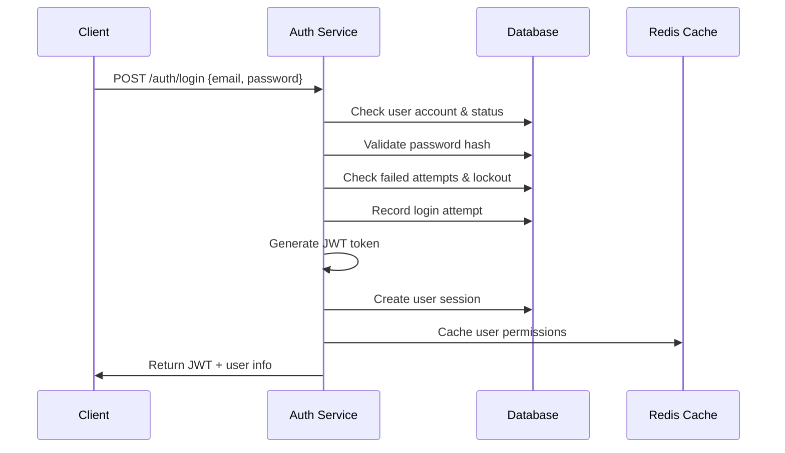
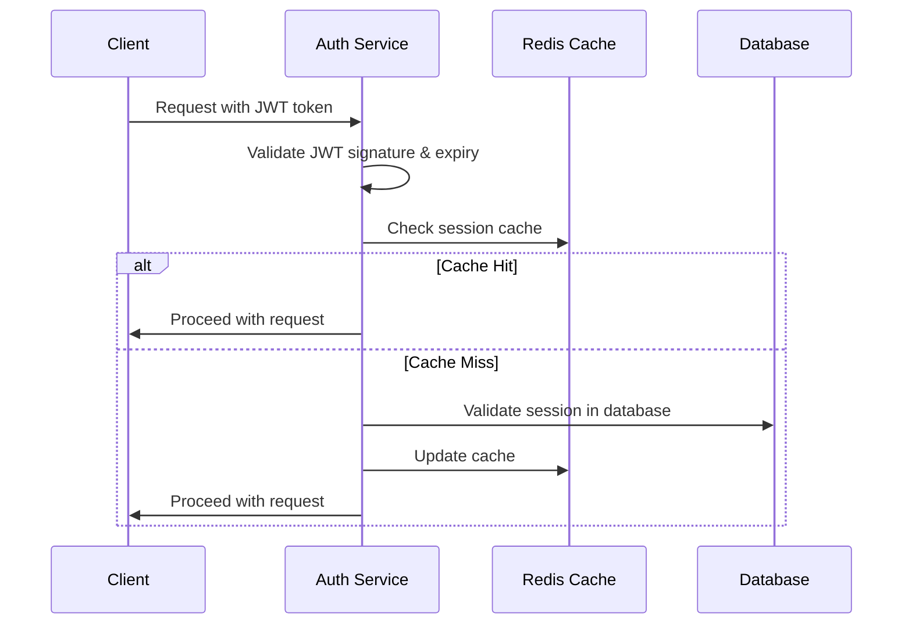

# Admin and Authentication Management

_Last updated: 2025-09-03_

## Overview

This module handles all administrative user management functions and user authentication for the inventory management system. It provides comprehensive user lifecycle management, authentication, session management, password policies, and security controls.

## Core Features

### 1. User Account Management

- **Create User Account**
  - Employee code (unique within tenant)
  - Email address (unique within tenant)
  - Display name
  - Role assignment (dropdown selection)
  - Initial password generation
  - Account status (ACTIVE/INACTIVE)

- **Update User Account**
  - Modify display name
  - Change employee code
  - Update role assignments
  - Change account status
  - Force password reset

- **Deactivate User Account**
  - Soft delete (status = INACTIVE)
  - Maintain audit trail
  - Revoke all active sessions
  - Prevent future logins

### 2. User Authentication System

- **Email-based Authentication**
  - Email and password login
  - Case-insensitive email handling
  - Multi-tenant support

- **Security Controls**
  - Failed login attempt tracking
  - Account lockout after 5 failed attempts
  - 30-minute lockout duration (configurable)
  - Login attempt rate limiting by IP

- **Session Management**
  - JWT token-based authentication
  - Secure session creation and validation
  - Session timeout (8 hours default)
  - Concurrent session management

### 3. Role Management

- **Role Assignment**
  - Multiple roles per user supported
  - Role-based access control (RBAC)
  - Hierarchical permissions

- **Available Roles**
  - `ADMIN` - Full system access
  - `MANAGER` - Store/Warehouse management
  - `CLERK` - Operations access
  - `VIEWER` - Read-only access

### 4. Password Management

- **Password Policy Enforcement**
  - Minimum 8 characters
  - Must contain: uppercase, lowercase, digit, special character
  - Cannot reuse last 3 passwords
  - 60-day expiry (configurable)

- **Password Reset Options**
  - Admin-initiated password reset
  - Self-service password reset
  - Force password change on next login
  - Generate secure temporary passwords
  - Password expiry notifications
  - 24-hour token expiry for reset tokens
  - Email-based reset process

### 5. Account Security Features

- **Login Attempt Monitoring**
  - Track failed login attempts
  - Automatic account lockout (5 attempts)
  - 30-minute lockout duration (configurable)
  - Manual unlock by admin

- **Session Management**
  - View active user sessions
  - Force session termination
  - Session timeout configuration
  - Concurrent session limits

- **Security Monitoring**
  - IP address tracking
  - User agent logging
  - Suspicious activity detection
  - Failed login notifications

## Authentication Flow

### Login Process


### Token Validation Flow


## API Endpoints

### Authentication
```http
POST   /api/auth/login                     # User login
POST   /api/auth/logout                    # User logout
POST   /api/auth/refresh                   # Refresh JWT token
GET    /api/auth/me                        # Get current user info
POST   /api/auth/change-password           # Change password
```

### Password Management
```http
POST   /api/auth/forgot-password           # Request password reset
POST   /api/auth/reset-password            # Reset password with token
POST   /api/auth/validate-token            # Validate reset token
GET    /api/auth/password-policy           # Get password requirements
```

### Session Management
```http
GET    /api/auth/sessions                  # Get user's active sessions
DELETE /api/auth/sessions/{sessionId}      # Terminate specific session
DELETE /api/auth/sessions                  # Terminate all sessions
```

### User Management (Admin)
```http
GET    /api/admin/users                    # List all users
POST   /api/admin/users                    # Create new user
GET    /api/admin/users/{id}               # Get user details
PUT    /api/admin/users/{id}               # Update user
DELETE /api/admin/users/{id}               # Deactivate user
POST   /api/admin/users/{id}/reset-password # Reset user password
POST   /api/admin/users/{id}/unlock        # Unlock user account
GET    /api/admin/users/{id}/sessions      # Get user sessions
DELETE /api/admin/users/{id}/sessions/{sessionId} # Terminate session
```

### Role Management (Admin)
```http
GET    /api/admin/roles                    # List all roles
POST   /api/admin/users/{id}/roles         # Assign role to user
DELETE /api/admin/users/{id}/roles/{roleId} # Remove role from user
```

### Configuration Management (Admin)
```http
GET    /api/admin/config                   # Get system configuration
PUT    /api/admin/config                   # Update configuration
```

## Data Transfer Objects (DTOs)

### LoginRequest
```java
public class LoginRequest {
    @NotBlank @Email
    private String email;
    
    @NotBlank @Size(min = 8, max = 128)
    private String password;
    
    private boolean rememberMe = false;
}
```

### LoginResponse
```java
public class LoginResponse {
    private String accessToken;
    private String refreshToken;
    private String tokenType = "Bearer";
    private long expiresIn;
    private UserInfo userInfo;
    private boolean mustChangePassword;
    private LocalDateTime passwordExpiresAt;
}
```

### CreateUserRequest
```java
public class CreateUserRequest {
    @NotBlank private String employeeCode;
    @Email private String email;
    @NotBlank private String displayName;
    @NotEmpty private Set<Long> roleIds;
    private String initialPassword; // Optional, will generate if null
}
```

### UserResponse
```java
public class UserResponse {
    private Long id;
    private String employeeCode;
    private String email;
    private String displayName;
    private UserStatus status;
    private Set<RoleDto> roles;
    private int failedLoginAttempts;
    private LocalDateTime accountLockedUntil;
    private LocalDateTime lastLoginAt;
    private LocalDateTime passwordExpiresAt;
    private boolean mustChangePassword;
    private LocalDateTime createdAt;
    private LocalDateTime updatedAt;
}
```

### ChangePasswordRequest
```java
public class ChangePasswordRequest {
    @NotBlank
    private String currentPassword;
    
    @NotBlank @Size(min = 8, max = 128)
    private String newPassword;
    
    @NotBlank
    private String confirmPassword;
}
```

### PasswordResetRequest
```java
public class PasswordResetRequest {
    @NotBlank @Email
    private String email;
}
```

### ResetPasswordRequest
```java
public class ResetPasswordRequest {
    @NotBlank
    private String token;
    
    @NotBlank @Size(min = 8, max = 128)
    private String newPassword;
    
    @NotBlank
    private String confirmPassword;
}
```

## Service Layer Architecture

### AdminUserService
```java
@Service
public class AdminUserService {

    // User CRUD operations
    Page<UserResponse> getAllUsers(Pageable pageable);
    UserResponse getUserById(Long id);
    UserResponse createUser(CreateUserRequest request);
    UserResponse updateUser(Long id, UpdateUserRequest request);
    void deactivateUser(Long id);

    // Password management
    String resetUserPassword(Long id);
    void forcePasswordChange(Long id);
    void unlockUserAccount(Long id);

    // Session management
    List<UserSessionDto> getUserSessions(Long id);
    void terminateUserSession(Long userId, String sessionId);
    void terminateAllUserSessions(Long userId);

    // Role management
    UserResponse assignRoleToUser(Long userId, Long roleId);
    UserResponse removeRoleFromUser(Long userId, Long roleId);
}
```

### AuthenticationService
```java
@Service
public class AuthenticationService {
    
    // Authentication operations
    LoginResponse login(LoginRequest request, String ipAddress, String userAgent);
    void logout(String sessionId);
    LoginResponse refreshToken(String refreshToken);
    
    // Password operations
    void changePassword(Long userId, ChangePasswordRequest request);
    void initiatePasswordReset(String email);
    void resetPassword(ResetPasswordRequest request);
    boolean validateResetToken(String token);
    
    // Session management
    List<UserSessionDto> getUserSessions(Long userId);
    void terminateSession(String sessionId);
    void terminateAllUserSessions(Long userId);
    
    // Account validation
    boolean isAccountLocked(Long userId);
    boolean isPasswordExpired(Long userId);
    void unlockAccount(Long userId);
}
```

### PasswordService
```java
@Service
public class PasswordService {

    // Password generation and validation
    String generateSecurePassword();
    boolean isPasswordValid(String password);
    boolean canReusePassword(Long userId, String hashedPassword);
    void savePasswordHistory(Long userId, String hashedPassword);
    LocalDateTime calculatePasswordExpiry();

    // Password policy validation
    PasswordValidationResult validatePassword(String password);
    boolean isPasswordExpired(LocalDateTime passwordExpiresAt);
    boolean isPasswordExpiringSoon(LocalDateTime passwordExpiresAt, int warningDays);
    
    // Password encoding and validation
    boolean validatePassword(String rawPassword, String hashedPassword);
    String hashPassword(String rawPassword);
    PasswordValidationResult validatePasswordPolicy(String password);
    
    // Reset token management
    String generateResetToken();
    List<UserDto> getUsersWithExpiringPasswords(int daysAhead);
}
```

### SessionService
```java
@Service
public class SessionService {
    
    // Session lifecycle
    UserSessionDto createSession(Long userId, String ipAddress, String userAgent);
    void updateSessionActivity(String sessionId);
    void invalidateSession(String sessionId);
    void cleanupExpiredSessions();
    
    // Session validation
    boolean isSessionValid(String sessionId);
    UserSessionDto getSessionInfo(String sessionId);
    
    // Session management
    List<UserSessionDto> getActiveUserSessions(Long userId);
    int getActiveSessionCount(Long userId);
    void terminateUserSessions(Long userId);
}
```

### LoginAttemptService
```java
@Service
public class LoginAttemptService {
    
    // Login attempt tracking
    void recordLoginAttempt(String email, String ipAddress, boolean success, String failureReason);
    int getFailedAttemptCount(String email);
    boolean isAccountLocked(String email);
    
    // Security monitoring
    void checkSuspiciousActivity(String email, String ipAddress);
    List<LoginAttemptDto> getRecentFailedAttempts(String email, int hours);
    
    // Account lockout management
    void lockAccount(String email);
    void unlockAccount(String email);
    LocalDateTime getLockoutExpiry(String email);
}
```

## Security Implementation

### JWT Token Configuration
```java
@Component
public class JwtTokenProvider {
    
    private static final String SECRET_KEY = "${app.jwt.secret}";
    private static final int EXPIRATION_TIME = 28800; // 8 hours in seconds
    private static final int REFRESH_EXPIRATION_TIME = 604800; // 7 days
    
    public String generateAccessToken(UserDetails userDetails);
    public String generateRefreshToken(UserDetails userDetails);
    public boolean validateToken(String token);
    public String getEmailFromToken(String token);
    public Date getExpirationDateFromToken(String token);
}
```

### Password Encoding Configuration
```java
@Configuration
public class PasswordConfig {
    
    @Bean
    public PasswordEncoder passwordEncoder() {
        return new BCryptPasswordEncoder(12);
    }
    
    @Bean
    public PasswordPolicy passwordPolicy() {
        return PasswordPolicy.builder()
            .minLength(8)
            .maxLength(128)
            .requireUppercase(1)
            .requireLowercase(1)
            .requireDigits(1)
            .requireSpecialChars(1)
            .build();
    }
}
```

### Security Configuration
```java
@Configuration
@EnableWebSecurity
@EnableMethodSecurity
public class SecurityConfig {
    
    @Bean
    public SecurityFilterChain filterChain(HttpSecurity http) throws Exception {
        return http
            .csrf(csrf -> csrf.disable())
            .sessionManagement(session -> session.sessionCreationPolicy(STATELESS))
            .authorizeHttpRequests(auth -> auth
                .requestMatchers("/api/auth/login", "/api/auth/forgot-password").permitAll()
                .requestMatchers("/api/admin/**").hasRole("ADMIN")
                .anyRequest().authenticated())
            .addFilterBefore(jwtAuthenticationFilter(), UsernamePasswordAuthenticationFilter.class)
            .exceptionHandling(ex -> ex
                .authenticationEntryPoint(authenticationEntryPoint())
                .accessDeniedHandler(accessDeniedHandler()))
            .build();
    }
}
```

## Security Considerations

### Authorization
- Only ADMIN role can access user management endpoints
- Audit all admin actions
- Multi-factor authentication for admin operations
- Rate limiting on sensitive operations

### Data Protection
- Hash passwords using BCrypt with salt
- Encrypt sensitive data in transit and at rest
- Implement data masking for logs
- GDPR compliance for user data

### Audit Trail
- Log all user management operations
- Track who performed each action
- Maintain immutable audit records
- Regular audit report generation

## Validation Rules

### Employee Code
- Alphanumeric characters only
- 3-32 characters length
- Unique within tenant
- Cannot be changed once set (business rule)

### Email Address
- Valid email format
- Maximum 320 characters
- Unique within tenant
- Case insensitive comparison

### Password Requirements
- Minimum 8 characters
- At least one uppercase letter
- At least one lowercase letter
- At least one digit
- At least one special character (!@#$%^&*)
- Cannot contain username or email

## Password Validation
```java
public enum PasswordValidationError {
    TOO_SHORT,
    TOO_LONG, 
    MISSING_UPPERCASE,
    MISSING_LOWERCASE,
    MISSING_DIGIT,
    MISSING_SPECIAL_CHAR,
    CONTAINS_EMAIL,
    CONTAINS_USERNAME,
    REUSED_PASSWORD,
    WEAK_PASSWORD
}

public class PasswordValidationResult {
    private boolean valid;
    private Set<PasswordValidationError> errors;
    private int strength; // 0-100
}
```

## Error Handling

### Common Error Responses
```http
400 Bad Request - Validation errors
401 Unauthorized - Authentication required
403 Forbidden - Insufficient permissions
404 Not Found - User not found
409 Conflict - Duplicate employee code/email
422 Unprocessable Entity - Business rule violations
429 Too Many Requests - Rate limit exceeded
500 Internal Server Error - System errors
```

### Authentication Exceptions
```java
public class AuthenticationException extends RuntimeException {
    public static class InvalidCredentialsException extends AuthenticationException {}
    public static class AccountLockedException extends AuthenticationException {}
    public static class PasswordExpiredException extends AuthenticationException {}
    public static class AccountDisabledException extends AuthenticationException {}
    public static class InvalidTokenException extends AuthenticationException {}
    public static class TokenExpiredException extends AuthenticationException {}
}
```

### Business Rule Violations
- Cannot deactivate the last admin user
- Cannot remove admin role from yourself
- Cannot unlock account with expired password
- Cannot create user with duplicate employee code

## Audit and Monitoring

### Security Events Logging
```java
@Component
public class SecurityAuditService {
    
    void logLoginAttempt(String email, String ipAddress, boolean success);
    void logPasswordChange(Long userId, String ipAddress);
    void logPasswordReset(String email, String ipAddress);
    void logAccountLockout(String email, String reason);
    void logSuspiciousActivity(String email, String ipAddress, String reason);
    void logSessionTermination(String sessionId, String reason);
}
```

### Security Metrics
```java
@Component
public class SecurityMetricsService {
    
    @EventListener
    void handleLoginAttempt(LoginAttemptEvent event);
    
    @EventListener  
    void handlePasswordChange(PasswordChangeEvent event);
    
    @EventListener
    void handleAccountLockout(AccountLockoutEvent event);
    
    // Metrics collection for monitoring
    Counter failedLoginAttempts;
    Counter successfulLogins;
    Counter accountLockouts;
    Timer loginDuration;
}
```

## Configuration Parameters

### System Configuration Keys
```properties
password.expiry.days=60
password.min.length=8
password.require.uppercase=true
password.require.lowercase=true
password.require.digit=true
password.require.special=true
password.history.count=3
login.max.attempts=5
login.lockout.minutes=30
session.timeout.minutes=480
password.reset.token.expiry.hours=24
admin.mfa.required=true
```

### Application Properties
```yaml
app:
  security:
    jwt:
      secret: ${JWT_SECRET:defaultSecretKey}
      expiration: 28800 # 8 hours
      refresh-expiration: 604800 # 7 days
    
    password:
      expiry-days: 60
      history-count: 3
      min-length: 8
      require-uppercase: true
      require-lowercase: true
      require-digit: true
      require-special: true
    
    login:
      max-attempts: 5
      lockout-minutes: 30
      rate-limit-per-minute: 10
    
    session:
      timeout-minutes: 480
      max-concurrent: 3
      cleanup-interval: 3600 # 1 hour
```

## Testing Strategy

### Unit Tests
- Service layer business logic
- Password validation rules
- Role assignment logic
- Security validations
- Authentication service tests
- Password policy enforcement

### Integration Tests
- Database operations
- API endpoint tests
- Authentication/authorization
- Audit logging verification
- End-to-end authentication flows
- Password reset flows
- Session management lifecycle

### Security Tests
- SQL injection prevention
- XSS protection
- Authentication bypass attempts
- Authorization boundary tests
- Brute force attack prevention
- JWT token validation
- Role-based access control

## Performance Considerations

### Database Optimization
- Proper indexing on search fields
- Pagination for user lists
- Query optimization for role lookups
- Connection pooling configuration
- Indexing on email, session_id
- Partition login_attempts table by date
- Regular cleanup of expired sessions and tokens

### Caching Strategy
- Cache user roles and permissions
- Cache system configuration
- Session data caching
- Cache invalidation on updates
- Cache password policies and configurations
- Cache JWT token blacklist for logout
- Session data caching with TTL

## Deployment Considerations

### Configuration Management
- Environment-specific configurations
- Secret management for sensitive data
- Database migration scripts
- Health check endpoints

### Environment Variables
```bash
JWT_SECRET=your-256-bit-secret-key
DB_PASSWORD=encrypted-password
REDIS_URL=redis://localhost:6379
SMTP_PASSWORD=email-service-password
```

### Health Checks
```java
@Component
public class AuthHealthIndicator implements HealthIndicator {
    
    @Override
    public Health health() {
        // Check database connectivity
        // Verify JWT signing capability  
        // Test Redis cache connectivity
        // Validate password encoding
    }
}
```

### Monitoring and Alerting
- Failed login attempt monitoring
- Account lockout alerts
- Password expiry notifications
- System configuration changes
- Failed login attempts spike
- Account lockout rate increase
- JWT token validation failures
- Session cleanup failures
- Database connection issues

## Operational Notes

### Database Schema Updates
- When applying schema migrations that change enum types to varchar, ensure Flyway forward migrations are used and tested in staging first.
- For DB updates to password_hash, write as binary literal to preserve leading `$` for bcrypt when using SQL: `UPDATE user_account SET password_hash = _binary'$2b$...'`.
- Several database columns used for account and tenant `status` were converted from MySQL `ENUM` to `VARCHAR` via forward Flyway migrations (V4..V8) so they match JPA `@Enumerated(EnumType.STRING)` mappings used by the application.
- If you encounter Hibernate validation errors about column types during startup, apply the missing migration(s) and re-run migrations before starting the service.
- Developer runtime: prefer JDK 17 for running the application locally. Ensure IDE and terminal use the same `JAVA_HOME`.

## Future Enhancements

### Advanced Security Features
- Multi-factor authentication (MFA)
- Single sign-on (SSO) integration
- OAuth 2.0 / OpenID Connect support
- Advanced threat detection
- Biometric authentication support
- Risk-based authentication
- Social login providers

### User Experience Improvements
- Self-service password reset
- User profile management
- Email notifications for account changes
- Mobile-friendly admin interface
- Remember device functionality
- Progressive web app support
- Password-less authentication
- Advanced password strength meter

### Compliance Features
- GDPR data export/deletion
- HIPAA compliance auditing
- SOC 2 compliance reporting
- Advanced audit analytics

## References

This document consolidates information from:
- ADMIN_USER_MANAGEMENT_DESIGN.md
- USER_AUTHENTICATION_DESIGN.md  
- admin-user-management.md