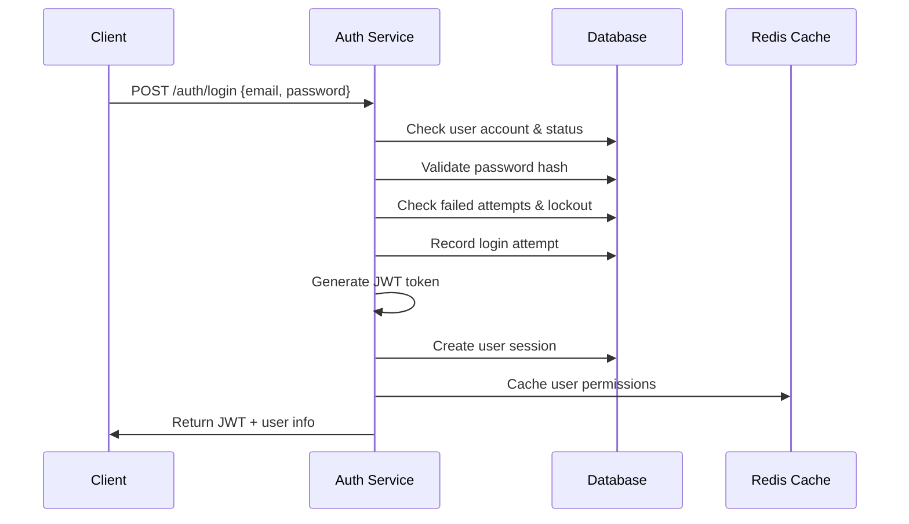
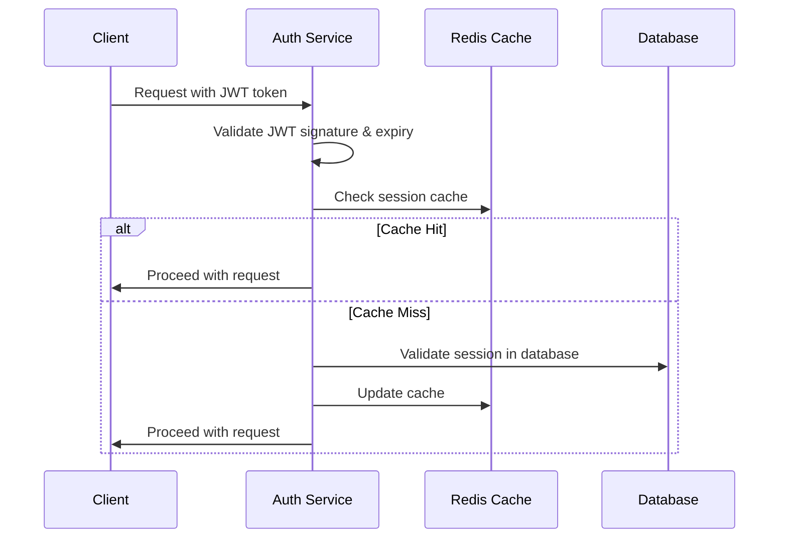

# User Authentication Module Design
_Last updated: 2025-09-03_

## Overview
This module handles user authentication, session management, password policies, and security controls for the inventory management system. It provides secure login, password management, and session tracking capabilities.

## Core Features

### 1. User Login System
- **Email-based Authentication**
  - Email and password login
  - Case-insensitive email handling
  - Multi-tenant support

- **Security Controls**
  - Failed login attempt tracking
  - Account lockout after 5 failed attempts
  - 30-minute lockout duration (configurable)
  - Login attempt rate limiting by IP

- **Session Management**
  - JWT token-based authentication
  - Secure session creation and validation
  - Session timeout (8 hours default)
  - Concurrent session management

### 2. Password Management
- **Password Policy Enforcement**
  - Minimum 8 characters
  - Required character types: uppercase, lowercase, digit, special
  - Password history tracking (last 3 passwords)
  - Password expiry every 60 days (configurable)

- **Password Reset Features**
  - Secure password reset tokens
  - 24-hour token expiry
  - Email-based reset process
  - Force password change on login

### 3. Account Security
- **Account Status Management**
  - Active/Inactive status validation
  - Temporary account suspension
  - Permanent account deactivation

- **Security Monitoring**
  - IP address tracking
  - User agent logging
  - Suspicious activity detection
  - Failed login notifications

## Authentication Flow

### Login Process


### Token Validation Flow


## API Endpoints

### Authentication
```http
POST   /api/auth/login                     # User login
POST   /api/auth/logout                    # User logout
POST   /api/auth/refresh                   # Refresh JWT token
GET    /api/auth/me                        # Get current user info
POST   /api/auth/change-password           # Change password
```

### Password Management
```http
POST   /api/auth/forgot-password           # Request password reset
POST   /api/auth/reset-password            # Reset password with token
POST   /api/auth/validate-token            # Validate reset token
GET    /api/auth/password-policy           # Get password requirements
```

### Session Management
```http
GET    /api/auth/sessions                  # Get user's active sessions
DELETE /api/auth/sessions/{sessionId}      # Terminate specific session
DELETE /api/auth/sessions                  # Terminate all sessions
```

## Data Transfer Objects (DTOs)

### LoginRequest
```java
public class LoginRequest {
    @NotBlank @Email
    private String email;
    
    @NotBlank @Size(min = 8, max = 128)
    private String password;
    
    private boolean rememberMe = false;
}
```

### LoginResponse
```java
public class LoginResponse {
    private String accessToken;
    private String refreshToken;
    private String tokenType = "Bearer";
    private long expiresIn;
    private UserInfo userInfo;
    private boolean mustChangePassword;
    private LocalDateTime passwordExpiresAt;
}
```

### ChangePasswordRequest
```java
public class ChangePasswordRequest {
    @NotBlank
    private String currentPassword;
    
    @NotBlank @Size(min = 8, max = 128)
    private String newPassword;
    
    @NotBlank
    private String confirmPassword;
}
```

### PasswordResetRequest
```java
public class PasswordResetRequest {
    @NotBlank @Email
    private String email;
}
```

### ResetPasswordRequest
```java
public class ResetPasswordRequest {
    @NotBlank
    private String token;
    
    @NotBlank @Size(min = 8, max = 128)
    private String newPassword;
    
    @NotBlank
    private String confirmPassword;
}
```

## Service Layer Architecture

### AuthenticationService
```java
@Service
public class AuthenticationService {
    
    // Authentication operations
    LoginResponse login(LoginRequest request, String ipAddress, String userAgent);
    void logout(String sessionId);
    LoginResponse refreshToken(String refreshToken);
    
    // Password operations
    void changePassword(Long userId, ChangePasswordRequest request);
    void initiatePasswordReset(String email);
    void resetPassword(ResetPasswordRequest request);
    boolean validateResetToken(String token);
    
    // Session management
    List<UserSessionDto> getUserSessions(Long userId);
    void terminateSession(String sessionId);
    void terminateAllUserSessions(Long userId);
    
    // Account validation
    boolean isAccountLocked(Long userId);
    boolean isPasswordExpired(Long userId);
    void unlockAccount(Long userId);
}
```

### PasswordService
```java
@Service  
public class PasswordService {
    
    // Password validation and hashing
    boolean validatePassword(String rawPassword, String hashedPassword);
    String hashPassword(String rawPassword);
    PasswordValidationResult validatePasswordPolicy(String password);
    
    // Password history
    boolean canReusePassword(Long userId, String newPasswordHash);
    void savePasswordHistory(Long userId, String passwordHash);
    
    // Password expiry
    LocalDateTime calculatePasswordExpiry();
    boolean isPasswordExpired(LocalDateTime passwordExpiresAt);
    List<UserDto> getUsersWithExpiringPasswords(int daysAhead);
    
    // Password generation
    String generateSecurePassword();
    String generateResetToken();
}
```

### SessionService
```java
@Service
public class SessionService {
    
    // Session lifecycle
    UserSessionDto createSession(Long userId, String ipAddress, String userAgent);
    void updateSessionActivity(String sessionId);
    void invalidateSession(String sessionId);
    void cleanupExpiredSessions();
    
    // Session validation
    boolean isSessionValid(String sessionId);
    UserSessionDto getSessionInfo(String sessionId);
    
    // Session management
    List<UserSessionDto> getActiveUserSessions(Long userId);
    int getActiveSessionCount(Long userId);
    void terminateUserSessions(Long userId);
}
```

### LoginAttemptService
```java
@Service
public class LoginAttemptService {
    
    // Login attempt tracking
    void recordLoginAttempt(String email, String ipAddress, boolean success, String failureReason);
    int getFailedAttemptCount(String email);
    boolean isAccountLocked(String email);
    
    // Security monitoring
    void checkSuspiciousActivity(String email, String ipAddress);
    List<LoginAttemptDto> getRecentFailedAttempts(String email, int hours);
    
    // Account lockout management
    void lockAccount(String email);
    void unlockAccount(String email);
    LocalDateTime getLockoutExpiry(String email);
}
```

## Security Implementation

### JWT Token Configuration
```java
@Component
public class JwtTokenProvider {
    
    private static final String SECRET_KEY = "${app.jwt.secret}";
    private static final int EXPIRATION_TIME = 28800; // 8 hours in seconds
    private static final int REFRESH_EXPIRATION_TIME = 604800; // 7 days
    
    public String generateAccessToken(UserDetails userDetails);
    public String generateRefreshToken(UserDetails userDetails);
    public boolean validateToken(String token);
    public String getEmailFromToken(String token);
    public Date getExpirationDateFromToken(String token);
}
```

### Password Encoding Configuration
```java
@Configuration
public class PasswordConfig {
    
    @Bean
    public PasswordEncoder passwordEncoder() {
        return new BCryptPasswordEncoder(12);
    }
    
    @Bean
    public PasswordPolicy passwordPolicy() {
        return PasswordPolicy.builder()
            .minLength(8)
            .maxLength(128)
            .requireUppercase(1)
            .requireLowercase(1)
            .requireDigits(1)
            .requireSpecialChars(1)
            .build();
    }
}
```

### Security Configuration
```java
@Configuration
@EnableWebSecurity
@EnableMethodSecurity
public class SecurityConfig {
    
    @Bean
    public SecurityFilterChain filterChain(HttpSecurity http) throws Exception {
        return http
            .csrf(csrf -> csrf.disable())
            .sessionManagement(session -> session.sessionCreationPolicy(STATELESS))
            .authorizeHttpRequests(auth -> auth
                .requestMatchers("/api/auth/login", "/api/auth/forgot-password").permitAll()
                .requestMatchers("/api/admin/**").hasRole("ADMIN")
                .anyRequest().authenticated())
            .addFilterBefore(jwtAuthenticationFilter(), UsernamePasswordAuthenticationFilter.class)
            .exceptionHandling(ex -> ex
                .authenticationEntryPoint(authenticationEntryPoint())
                .accessDeniedHandler(accessDeniedHandler()))
            .build();
    }
}
```

## Validation and Error Handling

### Password Validation
```java
public enum PasswordValidationError {
    TOO_SHORT,
    TOO_LONG, 
    MISSING_UPPERCASE,
    MISSING_LOWERCASE,
    MISSING_DIGIT,
    MISSING_SPECIAL_CHAR,
    CONTAINS_EMAIL,
    CONTAINS_USERNAME,
    REUSED_PASSWORD,
    WEAK_PASSWORD
}

public class PasswordValidationResult {
    private boolean valid;
    private Set<PasswordValidationError> errors;
    private int strength; // 0-100
}
```

### Authentication Exceptions
```java
public class AuthenticationException extends RuntimeException {
    public static class InvalidCredentialsException extends AuthenticationException {}
    public static class AccountLockedException extends AuthenticationException {}
    public static class PasswordExpiredException extends AuthenticationException {}
    public static class AccountDisabledException extends AuthenticationException {}
    public static class InvalidTokenException extends AuthenticationException {}
    public static class TokenExpiredException extends AuthenticationException {}
}
```

## Audit and Monitoring

### Security Events Logging
```java
@Component
public class SecurityAuditService {
    
    void logLoginAttempt(String email, String ipAddress, boolean success);
    void logPasswordChange(Long userId, String ipAddress);
    void logPasswordReset(String email, String ipAddress);
    void logAccountLockout(String email, String reason);
    void logSuspiciousActivity(String email, String ipAddress, String reason);
    void logSessionTermination(String sessionId, String reason);
}
```

### Security Metrics
```java
@Component
public class SecurityMetricsService {
    
    @EventListener
    void handleLoginAttempt(LoginAttemptEvent event);
    
    @EventListener  
    void handlePasswordChange(PasswordChangeEvent event);
    
    @EventListener
    void handleAccountLockout(AccountLockoutEvent event);
    
    // Metrics collection for monitoring
    Counter failedLoginAttempts;
    Counter successfulLogins;
    Counter accountLockouts;
    Timer loginDuration;
}
```

## Configuration Properties

### Application Properties
```yaml
app:
  security:
    jwt:
      secret: ${JWT_SECRET:defaultSecretKey}
      expiration: 28800 # 8 hours
      refresh-expiration: 604800 # 7 days
    
    password:
      expiry-days: 60
      history-count: 3
      min-length: 8
      require-uppercase: true
      require-lowercase: true
      require-digit: true
      require-special: true
    
    login:
      max-attempts: 5
      lockout-minutes: 30
      rate-limit-per-minute: 10
    
    session:
      timeout-minutes: 480
      max-concurrent: 3
      cleanup-interval: 3600 # 1 hour
```

## Testing Strategy

### Unit Tests
```java
@ExtendWith(MockitoExtension.class)
class AuthenticationServiceTest {
    
    @Test
    void shouldLoginSuccessfullyWithValidCredentials();
    
    @Test
    void shouldThrowExceptionForInvalidCredentials();
    
    @Test
    void shouldLockAccountAfterMaxFailedAttempts();
    
    @Test
    void shouldValidatePasswordPolicy();
    
    @Test
    void shouldPreventPasswordReuse();
}
```

### Integration Tests
```java
@SpringBootTest
@AutoConfigureTestDatabase
class AuthenticationIntegrationTest {
    
    @Test
    void shouldAuthenticateUserEndToEnd();
    
    @Test
    void shouldHandlePasswordResetFlow();
    
    @Test
    void shouldManageSessionLifecycle();
}
```

### Security Tests
```java
@SpringBootTest
@AutoConfigureTestDatabase  
class SecurityTest {
    
    @Test
    void shouldPreventBruteForceAttacks();
    
    @Test
    void shouldValidateJWTTokens();
    
    @Test
    void shouldEnforceRoleBasedAccess();
}
```

## Performance Optimization

### Caching Strategy
- Cache user permissions in Redis
- Cache password policies and configurations
- Cache JWT token blacklist for logout
- Session data caching with TTL

### Database Optimization
- Proper indexing on email, session_id
- Partition login_attempts table by date
- Regular cleanup of expired sessions and tokens
- Connection pooling configuration

## Deployment and Operations

### Environment Variables
```bash
JWT_SECRET=your-256-bit-secret-key
DB_PASSWORD=encrypted-password
REDIS_URL=redis://localhost:6379
SMTP_PASSWORD=email-service-password
```

### Health Checks
```java
@Component
public class AuthHealthIndicator implements HealthIndicator {
    
    @Override
    public Health health() {
        // Check database connectivity
        // Verify JWT signing capability  
        // Test Redis cache connectivity
        // Validate password encoding
    }
}
```

### Monitoring Alerts
- Failed login attempts spike
- Account lockout rate increase
- JWT token validation failures
- Session cleanup failures
- Database connection issues

## Future Enhancements

### Advanced Security
- Multi-factor authentication (TOTP, SMS)
- Biometric authentication support
- OAuth 2.0 / OpenID Connect integration
- Social login providers
- Risk-based authentication

### User Experience
- Remember device functionality
- Progressive web app support
- Single sign-on (SSO) integration
- Password-less authentication
- Advanced password strength meter