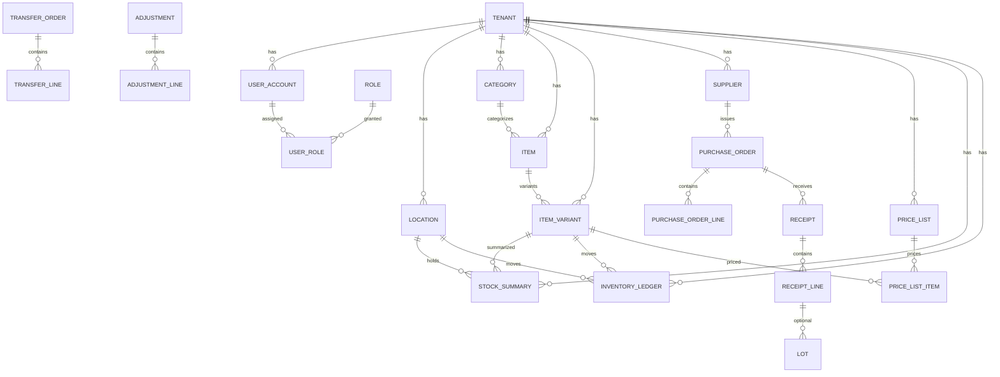

# ER Diagram (Mermaid) — SaaS Inventory Platform
_Generated: 2025-08-31 13:00 UTC_

```mermaid
erDiagram
  TENANT ||--o{ USER_ACCOUNT : "has"
  TENANT ||--o{ LOCATION : "has"
  TENANT ||--o{ CATEGORY : "has"
  TENANT ||--o{ ITEM : "has"
  TENANT ||--o{ ITEM_VARIANT : "has"
  TENANT ||--o{ SUPPLIER : "has"
  TENANT ||--o{ PRICE_LIST : "has"
  TENANT ||--o{ STOCK_SUMMARY : "has"
  TENANT ||--o{ INVENTORY_LEDGER : "has"

  USER_ACCOUNT ||--o{ USER_ROLE : "assigned"
  ROLE ||--o{ USER_ROLE : "granted"

  CATEGORY ||--o{ ITEM : "categorizes"
  ITEM ||--o{ ITEM_VARIANT : "variants"
  ITEM_VARIANT ||--o{ STOCK_SUMMARY : "summarized"
  ITEM_VARIANT ||--o{ INVENTORY_LEDGER : "moves"
  LOCATION ||--o{ STOCK_SUMMARY : "holds"
  LOCATION ||--o{ INVENTORY_LEDGER : "moves"

  SUPPLIER ||--o{ PURCHASE_ORDER : "issues"
  PURCHASE_ORDER ||--o{ PURCHASE_ORDER_LINE : "contains"
  PURCHASE_ORDER ||--o{ RECEIPT : "receives"
  RECEIPT ||--o{ RECEIPT_LINE : "contains"
  RECEIPT_LINE ||--o{ LOT : "optional"

  TRANSFER_ORDER ||--o{ TRANSFER_LINE : "contains"
  ADJUSTMENT ||--o{ ADJUSTMENT_LINE : "contains"

  PRICE_LIST ||--o{ PRICE_LIST_ITEM : "prices"
  ITEM_VARIANT ||--o{ PRICE_LIST_ITEM : "priced"
```
