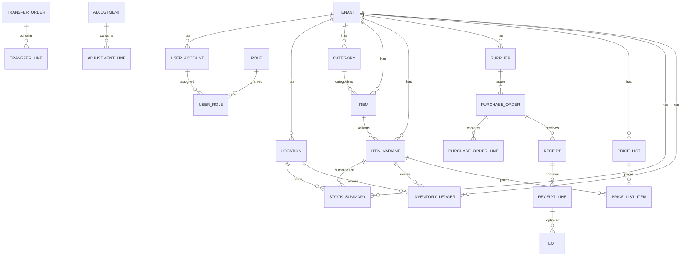

# Database and Schema Management

_Last updated: 2025-09-03_

## Overview

This document covers the complete database schema design, entity relationships, connection configuration, and operational guidance for the multi-tenant SaaS inventory management system.

## Database Architecture

### Tenancy Model
- **Single database** with **row-level isolation** by `tenant_id`
- All business tables include `tenant_id` for tenant scoping
- Enforce isolation in application layer through JWT claims → `tenant_id`
- Composite unique keys include `tenant_id` for data integrity
- All tables use **InnoDB** engine with **utf8mb4** collation
- Timestamps stored in UTC

### Connection Configuration

#### Current Connection Setup
- **MySQL**: `localhost:3307` (Docker container)
- **Redis**: `localhost:6379`  
- **phpMyAdmin**: `http://localhost:8080`
- **Redis Commander**: `http://localhost:8081`

#### Connection Details
```bash
# MySQL connection from command line
mysql -h 127.0.0.1 -P 3307 -u inventory_user -p
# Password: inventory_pass

# Test connection
mysql -h 127.0.0.1 -P 3307 -u inventory_user -pinventory_pass -e "SELECT 'Success!' as status;"
```

#### Application Configuration Files
- `src/main/resources/application.yml` - Spring Boot datasource config
- `pom.xml` - Flyway configuration
- `docker-compose.yml` - Docker services configuration

### Connection Troubleshooting

#### Common Issues and Solutions
1. **Port Conflicts**: Changed Docker MySQL port from `3306` to `3307` to avoid conflicts with local MySQL
2. **Authentication**: Fixed user authentication to use `mysql_native_password`
3. **Host Resolution**: Use `127.0.0.1` instead of `localhost` to force TCP connection to Docker container

#### Verification Commands
```bash
# Check Docker containers
docker-compose ps

# Test application startup
mvn spring-boot:run

# Run Flyway migrations
mvn flyway:migrate
```

## Database Schema

### Session Defaults
```sql
SET NAMES utf8mb4 COLLATE utf8mb4_0900_ai_ci;
SET time_zone = '+00:00';
```

### 1. Core: Tenants, Users, Roles & Locations

```sql
CREATE TABLE tenant (
  id            BIGINT PRIMARY KEY AUTO_INCREMENT,
  code          VARCHAR(64) NOT NULL UNIQUE,
  name          VARCHAR(255) NOT NULL,
  status        VARCHAR(20) NOT NULL DEFAULT 'ACTIVE', -- Changed from ENUM
  created_at    TIMESTAMP NOT NULL DEFAULT CURRENT_TIMESTAMP,
  updated_at    TIMESTAMP NOT NULL DEFAULT CURRENT_TIMESTAMP ON UPDATE CURRENT_TIMESTAMP
) ENGINE=InnoDB;

CREATE TABLE user_account (
  id            BIGINT PRIMARY KEY AUTO_INCREMENT,
  tenant_id     BIGINT NOT NULL,
  email         VARCHAR(320) NOT NULL,
  display_name  VARCHAR(255) NOT NULL,
  password_hash VARBINARY(255) NULL, -- BCrypt hash for internal auth
  status        VARCHAR(20) NOT NULL DEFAULT 'ACTIVE', -- Changed from ENUM
  created_at    TIMESTAMP NOT NULL DEFAULT CURRENT_TIMESTAMP,
  updated_at    TIMESTAMP NOT NULL DEFAULT CURRENT_TIMESTAMP ON UPDATE CURRENT_TIMESTAMP,
  UNIQUE KEY uq_user_email_tenant (tenant_id, email),
  CONSTRAINT fk_user_tenant FOREIGN KEY (tenant_id) REFERENCES tenant(id) ON DELETE CASCADE ON UPDATE RESTRICT
) ENGINE=InnoDB;

CREATE TABLE role (
  id          BIGINT PRIMARY KEY AUTO_INCREMENT,
  code        VARCHAR(64) NOT NULL,
  name        VARCHAR(128) NOT NULL,
  UNIQUE KEY uq_role_code (code)
) ENGINE=InnoDB;

CREATE TABLE user_role (
  user_id    BIGINT NOT NULL,
  role_id    BIGINT NOT NULL,
  PRIMARY KEY (user_id, role_id),
  CONSTRAINT fk_ur_user FOREIGN KEY (user_id) REFERENCES user_account(id) ON DELETE CASCADE,
  CONSTRAINT fk_ur_role FOREIGN KEY (role_id) REFERENCES role(id) ON DELETE RESTRICT
) ENGINE=InnoDB;

CREATE TABLE location (
  id            BIGINT PRIMARY KEY AUTO_INCREMENT,
  tenant_id     BIGINT NOT NULL,
  code          VARCHAR(64) NOT NULL,
  name          VARCHAR(255) NOT NULL,
  type          VARCHAR(20) NOT NULL, -- Changed from ENUM: 'STORE','WAREHOUSE'
  status        VARCHAR(20) NOT NULL DEFAULT 'ACTIVE', -- Changed from ENUM
  created_at    TIMESTAMP NOT NULL DEFAULT CURRENT_TIMESTAMP,
  updated_at    TIMESTAMP NOT NULL DEFAULT CURRENT_TIMESTAMP ON UPDATE CURRENT_TIMESTAMP,
  UNIQUE KEY uq_loc_code_tenant (tenant_id, code),
  KEY ix_loc_tenant (tenant_id),
  CONSTRAINT fk_loc_tenant FOREIGN KEY (tenant_id) REFERENCES tenant(id) ON DELETE CASCADE
) ENGINE=InnoDB;
```

### 2. Catalog: Categories, Items, Variants

```sql
CREATE TABLE category (
  id            BIGINT PRIMARY KEY AUTO_INCREMENT,
  tenant_id     BIGINT NOT NULL,
  code          VARCHAR(64) NOT NULL,
  name          VARCHAR(255) NOT NULL,
  parent_id     BIGINT NULL,
  created_at    TIMESTAMP NOT NULL DEFAULT CURRENT_TIMESTAMP,
  updated_at    TIMESTAMP NOT NULL DEFAULT CURRENT_TIMESTAMP ON UPDATE CURRENT_TIMESTAMP,
  UNIQUE KEY uq_cat_code_tenant (tenant_id, code),
  KEY ix_cat_tenant (tenant_id),
  CONSTRAINT fk_cat_tenant FOREIGN KEY (tenant_id) REFERENCES tenant(id) ON DELETE CASCADE,
  CONSTRAINT fk_cat_parent FOREIGN KEY (parent_id) REFERENCES category(id) ON DELETE SET NULL
) ENGINE=InnoDB;

CREATE TABLE item (
  id            BIGINT PRIMARY KEY AUTO_INCREMENT,
  tenant_id     BIGINT NOT NULL,
  sku           VARCHAR(64) NOT NULL,
  name          VARCHAR(255) NOT NULL,
  brand         VARCHAR(128),
  category_id   BIGINT NULL,
  status        VARCHAR(20) NOT NULL DEFAULT 'ACTIVE', -- 'DRAFT','ACTIVE','DISCONTINUED'
  created_at    TIMESTAMP NOT NULL DEFAULT CURRENT_TIMESTAMP,
  updated_at    TIMESTAMP NOT NULL DEFAULT CURRENT_TIMESTAMP ON UPDATE CURRENT_TIMESTAMP,
  UNIQUE KEY uq_item_sku_tenant (tenant_id, sku),
  KEY ix_item_cat (category_id),
  KEY ix_item_tenant (tenant_id),
  CONSTRAINT fk_item_tenant FOREIGN KEY (tenant_id) REFERENCES tenant(id) ON DELETE CASCADE,
  CONSTRAINT fk_item_category FOREIGN KEY (category_id) REFERENCES category(id) ON DELETE SET NULL
) ENGINE=InnoDB;

CREATE TABLE item_variant (
  id            BIGINT PRIMARY KEY AUTO_INCREMENT,
  tenant_id     BIGINT NOT NULL,
  item_id       BIGINT NOT NULL,
  variant_sku   VARCHAR(64) NOT NULL,
  attributes_json JSON NULL, -- size/color, etc.
  status        VARCHAR(20) NOT NULL DEFAULT 'ACTIVE', -- 'ACTIVE','DISCONTINUED'
  created_at    TIMESTAMP NOT NULL DEFAULT CURRENT_TIMESTAMP,
  updated_at    TIMESTAMP NOT NULL DEFAULT CURRENT_TIMESTAMP ON UPDATE CURRENT_TIMESTAMP,
  UNIQUE KEY uq_variant_sku_tenant (tenant_id, variant_sku),
  KEY ix_variant_item (item_id),
  KEY ix_variant_tenant (tenant_id),
  CONSTRAINT fk_variant_item FOREIGN KEY (item_id) REFERENCES item(id) ON DELETE CASCADE,
  CONSTRAINT fk_variant_tenant FOREIGN KEY (tenant_id) REFERENCES tenant(id) ON DELETE CASCADE
) ENGINE=InnoDB;
```

### 3. Inventory: Ledger, Summary, Serial/Lot Tracking

```sql
CREATE TABLE inventory_ledger (
  id            BIGINT PRIMARY KEY AUTO_INCREMENT,
  tenant_id     BIGINT NOT NULL,
  location_id   BIGINT NOT NULL,
  variant_id    BIGINT NOT NULL,
  ref_type      VARCHAR(20) NOT NULL, -- 'RECEIPT','SHIPMENT','TRANSFER','ADJUSTMENT','COUNT'
  ref_id        VARCHAR(64) NOT NULL,
  qty_delta     INT NOT NULL, -- positive/negative
  reason_code   VARCHAR(32),
  ts            TIMESTAMP NOT NULL DEFAULT CURRENT_TIMESTAMP,
  user_id       BIGINT NULL,
  -- Idempotency to prevent duplicates from integrations:
  UNIQUE KEY uq_ledger_idem (tenant_id, ref_type, ref_id, variant_id, location_id),
  KEY ix_led_loc_sku_ts (tenant_id, location_id, variant_id, ts),
  CONSTRAINT fk_led_tenant FOREIGN KEY (tenant_id) REFERENCES tenant(id) ON DELETE CASCADE,
  CONSTRAINT fk_led_location FOREIGN KEY (location_id) REFERENCES location(id) ON DELETE RESTRICT,
  CONSTRAINT fk_led_variant FOREIGN KEY (variant_id) REFERENCES item_variant(id) ON DELETE RESTRICT
) ENGINE=InnoDB;

CREATE TABLE stock_summary (
  tenant_id     BIGINT NOT NULL,
  location_id   BIGINT NOT NULL,
  variant_id    BIGINT NOT NULL,
  on_hand       INT NOT NULL DEFAULT 0,
  reserved      INT NOT NULL DEFAULT 0,
  available     INT AS (on_hand - reserved) STORED,
  updated_at    TIMESTAMP NOT NULL DEFAULT CURRENT_TIMESTAMP ON UPDATE CURRENT_TIMESTAMP,
  PRIMARY KEY (tenant_id, location_id, variant_id),
  CONSTRAINT fk_sum_tenant FOREIGN KEY (tenant_id) REFERENCES tenant(id) ON DELETE CASCADE,
  CONSTRAINT fk_sum_location FOREIGN KEY (location_id) REFERENCES location(id) ON DELETE RESTRICT,
  CONSTRAINT fk_sum_variant FOREIGN KEY (variant_id) REFERENCES item_variant(id) ON DELETE RESTRICT
) ENGINE=InnoDB;

-- Optional: serial/lot tracking
CREATE TABLE lot (
  id            BIGINT PRIMARY KEY AUTO_INCREMENT,
  tenant_id     BIGINT NOT NULL,
  variant_id    BIGINT NOT NULL,
  lot_code      VARCHAR(64) NOT NULL,
  expiry_date   DATE NULL,
  UNIQUE KEY uq_lot_code (tenant_id, variant_id, lot_code),
  CONSTRAINT fk_lot_tenant FOREIGN KEY (tenant_id) REFERENCES tenant(id) ON DELETE CASCADE,
  CONSTRAINT fk_lot_variant FOREIGN KEY (variant_id) REFERENCES item_variant(id) ON DELETE CASCADE
) ENGINE=InnoDB;
```

### 4. Suppliers, Purchasing & Receiving

```sql
CREATE TABLE supplier (
  id            BIGINT PRIMARY KEY AUTO_INCREMENT,
  tenant_id     BIGINT NOT NULL,
  code          VARCHAR(64) NOT NULL,
  name          VARCHAR(255) NOT NULL,
  contact_email VARCHAR(320),
  status        VARCHAR(20) NOT NULL DEFAULT 'ACTIVE',
  created_at    TIMESTAMP NOT NULL DEFAULT CURRENT_TIMESTAMP,
  updated_at    TIMESTAMP NOT NULL DEFAULT CURRENT_TIMESTAMP ON UPDATE CURRENT_TIMESTAMP,
  UNIQUE KEY uq_supplier_code (tenant_id, code),
  CONSTRAINT fk_supplier_tenant FOREIGN KEY (tenant_id) REFERENCES tenant(id) ON DELETE CASCADE
) ENGINE=InnoDB;

CREATE TABLE purchase_order (
  id            BIGINT PRIMARY KEY AUTO_INCREMENT,
  tenant_id     BIGINT NOT NULL,
  supplier_id   BIGINT NOT NULL,
  location_id   BIGINT NOT NULL, -- deliver-to
  code          VARCHAR(64) NOT NULL,
  status        VARCHAR(20) NOT NULL DEFAULT 'DRAFT', -- 'DRAFT','APPROVED','PARTIAL','RECEIVED','CANCELLED'
  eta_date      DATE NULL,
  created_at    TIMESTAMP NOT NULL DEFAULT CURRENT_TIMESTAMP,
  updated_at    TIMESTAMP NOT NULL DEFAULT CURRENT_TIMESTAMP ON UPDATE CURRENT_TIMESTAMP,
  UNIQUE KEY uq_po_code (tenant_id, code),
  KEY ix_po_supplier (supplier_id),
  CONSTRAINT fk_po_tenant FOREIGN KEY (tenant_id) REFERENCES tenant(id) ON DELETE CASCADE,
  CONSTRAINT fk_po_supplier FOREIGN KEY (supplier_id) REFERENCES supplier(id) ON DELETE RESTRICT,
  CONSTRAINT fk_po_location FOREIGN KEY (location_id) REFERENCES location(id) ON DELETE RESTRICT
) ENGINE=InnoDB;

CREATE TABLE purchase_order_line (
  id            BIGINT PRIMARY KEY AUTO_INCREMENT,
  po_id         BIGINT NOT NULL,
  tenant_id     BIGINT NOT NULL,
  variant_id    BIGINT NOT NULL,
  qty_ordered   INT NOT NULL,
  unit_cost     DECIMAL(12,4) NOT NULL DEFAULT 0,
  qty_received  INT NOT NULL DEFAULT 0,
  CONSTRAINT fk_pol_po FOREIGN KEY (po_id) REFERENCES purchase_order(id) ON DELETE CASCADE,
  CONSTRAINT fk_pol_variant FOREIGN KEY (variant_id) REFERENCES item_variant(id) ON DELETE RESTRICT,
  CONSTRAINT fk_pol_tenant FOREIGN KEY (tenant_id) REFERENCES tenant(id) ON DELETE CASCADE,
  UNIQUE KEY uq_pol (po_id, variant_id)
) ENGINE=InnoDB;

CREATE TABLE receipt (
  id            BIGINT PRIMARY KEY AUTO_INCREMENT,
  tenant_id     BIGINT NOT NULL,
  po_id         BIGINT NULL,
  location_id   BIGINT NOT NULL,
  received_at   TIMESTAMP NOT NULL DEFAULT CURRENT_TIMESTAMP,
  created_by    BIGINT NULL,
  CONSTRAINT fk_receipt_tenant FOREIGN KEY (tenant_id) REFERENCES tenant(id) ON DELETE CASCADE,
  CONSTRAINT fk_receipt_po FOREIGN KEY (po_id) REFERENCES purchase_order(id) ON DELETE SET NULL,
  CONSTRAINT fk_receipt_location FOREIGN KEY (location_id) REFERENCES location(id) ON DELETE RESTRICT
) ENGINE=InnoDB;

CREATE TABLE receipt_line (
  id            BIGINT PRIMARY KEY AUTO_INCREMENT,
  receipt_id    BIGINT NOT NULL,
  tenant_id     BIGINT NOT NULL,
  variant_id    BIGINT NOT NULL,
  qty_received  INT NOT NULL,
  lot_id        BIGINT NULL,
  CONSTRAINT fk_rl_receipt FOREIGN KEY (receipt_id) REFERENCES receipt(id) ON DELETE CASCADE,
  CONSTRAINT fk_rl_variant FOREIGN KEY (variant_id) REFERENCES item_variant(id) ON DELETE RESTRICT,
  CONSTRAINT fk_rl_tenant FOREIGN KEY (tenant_id) REFERENCES tenant(id) ON DELETE CASCADE,
  CONSTRAINT fk_rl_lot FOREIGN KEY (lot_id) REFERENCES lot(id) ON DELETE SET NULL
) ENGINE=InnoDB;
```

### 5. Transfers & Adjustments

```sql
CREATE TABLE transfer_order (
  id            BIGINT PRIMARY KEY AUTO_INCREMENT,
  tenant_id     BIGINT NOT NULL,
  code          VARCHAR(64) NOT NULL,
  source_loc_id BIGINT NOT NULL,
  dest_loc_id   BIGINT NOT NULL,
  status        VARCHAR(20) NOT NULL DEFAULT 'DRAFT', -- 'DRAFT','DISPATCHED','RECEIVED','CANCELLED'
  created_at    TIMESTAMP NOT NULL DEFAULT CURRENT_TIMESTAMP,
  updated_at    TIMESTAMP NOT NULL DEFAULT CURRENT_TIMESTAMP ON UPDATE CURRENT_TIMESTAMP,
  UNIQUE KEY uq_to_code (tenant_id, code),
  CONSTRAINT fk_to_tenant FOREIGN KEY (tenant_id) REFERENCES tenant(id) ON DELETE CASCADE,
  CONSTRAINT fk_to_src FOREIGN KEY (source_loc_id) REFERENCES location(id) ON DELETE RESTRICT,
  CONSTRAINT fk_to_dest FOREIGN KEY (dest_loc_id) REFERENCES location(id) ON DELETE RESTRICT,
  CHECK (source_loc_id <> dest_loc_id)
) ENGINE=InnoDB;

CREATE TABLE transfer_line (
  id            BIGINT PRIMARY KEY AUTO_INCREMENT,
  transfer_id   BIGINT NOT NULL,
  tenant_id     BIGINT NOT NULL,
  variant_id    BIGINT NOT NULL,
  qty           INT NOT NULL,
  CONSTRAINT fk_tl_transfer FOREIGN KEY (transfer_id) REFERENCES transfer_order(id) ON DELETE CASCADE,
  CONSTRAINT fk_tl_variant FOREIGN KEY (variant_id) REFERENCES item_variant(id) ON DELETE RESTRICT,
  CONSTRAINT fk_tl_tenant FOREIGN KEY (tenant_id) REFERENCES tenant(id) ON DELETE CASCADE,
  UNIQUE KEY uq_tl (transfer_id, variant_id)
) ENGINE=InnoDB;

CREATE TABLE adjustment (
  id            BIGINT PRIMARY KEY AUTO_INCREMENT,
  tenant_id     BIGINT NOT NULL,
  location_id   BIGINT NOT NULL,
  reason_code   VARCHAR(32) NOT NULL,
  notes         VARCHAR(512),
  created_at    TIMESTAMP NOT NULL DEFAULT CURRENT_TIMESTAMP,
  created_by    BIGINT NULL,
  CONSTRAINT fk_adj_tenant FOREIGN KEY (tenant_id) REFERENCES tenant(id) ON DELETE CASCADE,
  CONSTRAINT fk_adj_location FOREIGN KEY (location_id) REFERENCES location(id) ON DELETE RESTRICT
) ENGINE=InnoDB;

CREATE TABLE adjustment_line (
  id            BIGINT PRIMARY KEY AUTO_INCREMENT,
  adjustment_id BIGINT NOT NULL,
  tenant_id     BIGINT NOT NULL,
  variant_id    BIGINT NOT NULL,
  qty_delta     INT NOT NULL,
  CONSTRAINT fk_al_adj FOREIGN KEY (adjustment_id) REFERENCES adjustment(id) ON DELETE CASCADE,
  CONSTRAINT fk_al_variant FOREIGN KEY (variant_id) REFERENCES item_variant(id) ON DELETE RESTRICT,
  CONSTRAINT fk_al_tenant FOREIGN KEY (tenant_id) REFERENCES tenant(id) ON DELETE CASCADE,
  UNIQUE KEY uq_al (adjustment_id, variant_id)
) ENGINE=InnoDB;
```

### 6. Pricing & Promotions

```sql
CREATE TABLE price_list (
  id            BIGINT PRIMARY KEY AUTO_INCREMENT,
  tenant_id     BIGINT NOT NULL,
  code          VARCHAR(64) NOT NULL,
  name          VARCHAR(255) NOT NULL,
  currency      CHAR(3) NOT NULL,
  valid_from    DATE NULL,
  valid_to      DATE NULL,
  UNIQUE KEY uq_pl_code (tenant_id, code),
  CONSTRAINT fk_pl_tenant FOREIGN KEY (tenant_id) REFERENCES tenant(id) ON DELETE CASCADE
) ENGINE=InnoDB;

CREATE TABLE price_list_item (
  id            BIGINT PRIMARY KEY AUTO_INCREMENT,
  tenant_id     BIGINT NOT NULL,
  price_list_id BIGINT NOT NULL,
  variant_id    BIGINT NOT NULL,
  price         DECIMAL(12,4) NOT NULL,
  UNIQUE KEY uq_pli (price_list_id, variant_id),
  CONSTRAINT fk_pli_tenant FOREIGN KEY (tenant_id) REFERENCES tenant(id) ON DELETE CASCADE,
  CONSTRAINT fk_pli_pl FOREIGN KEY (price_list_id) REFERENCES price_list(id) ON DELETE CASCADE,
  CONSTRAINT fk_pli_variant FOREIGN KEY (variant_id) REFERENCES item_variant(id) ON DELETE RESTRICT
) ENGINE=InnoDB;
```

### 7. Integration & Extensibility

```sql
-- Outbox for reliable event publishing (Debezium-friendly)
CREATE TABLE events_outbox (
  id            BIGINT PRIMARY KEY AUTO_INCREMENT,
  tenant_id     BIGINT NOT NULL,
  aggregate_type VARCHAR(64) NOT NULL,
  aggregate_id   VARCHAR(64) NOT NULL,
  event_type     VARCHAR(64) NOT NULL,
  payload        JSON NOT NULL,
  created_at     TIMESTAMP NOT NULL DEFAULT CURRENT_TIMESTAMP,
  published      TINYINT(1) NOT NULL DEFAULT 0,
  KEY ix_outbox_pub (published, created_at),
  KEY ix_outbox_tenant (tenant_id),
  CONSTRAINT fk_outbox_tenant FOREIGN KEY (tenant_id) REFERENCES tenant(id) ON DELETE CASCADE
) ENGINE=InnoDB;

CREATE TABLE webhook_subscription (
  id            BIGINT PRIMARY KEY AUTO_INCREMENT,
  tenant_id     BIGINT NOT NULL,
  event_type    VARCHAR(64) NOT NULL,
  target_url    VARCHAR(1024) NOT NULL,
  secret        VARCHAR(255) NULL,
  status        VARCHAR(20) NOT NULL DEFAULT 'ACTIVE',
  UNIQUE KEY uq_wh (tenant_id, event_type, target_url),
  CONSTRAINT fk_wh_tenant FOREIGN KEY (tenant_id) REFERENCES tenant(id) ON DELETE CASCADE
) ENGINE=InnoDB;
```

## Entity Relationship Diagram



## Database Performance & Optimization

### Indexing Strategy

#### Required Indexes
- Add **covering indexes** for frequent queries (e.g., `(tenant_id, sku)` / `(tenant_id, location_id, variant_id)`)
- Proper indexing on search fields for user management
- Pagination support for user lists
- Query optimization for role lookups

#### Partitioning for High Volume
Consider **partitioning `inventory_ledger` by RANGE on `ts`** for high‑volume tenants:

```sql
ALTER TABLE inventory_ledger
PARTITION BY RANGE (TO_DAYS(ts)) (
  PARTITION p2025q3 VALUES LESS THAN (TO_DAYS('2025-10-01')),
  PARTITION pmax VALUES LESS THAN MAXVALUE
);
```

### Connection Pooling
- Configure appropriate connection pool sizes
- Use read replicas for reporting queries
- Route queries via ProxySQL/HAProxy for load balancing

## Referential Integrity

### CASCADE Rules
- Most child tables use `ON DELETE CASCADE` from parents within the same bounded context
- Cross‑context FKs use `ON DELETE RESTRICT` to preserve data integrity
- Soft deletes for user accounts maintain audit trails

### Business Constraints
- Composite unique keys include `tenant_id` for multi-tenant isolation
- CHECK constraints for business rules (e.g., source_loc_id <> dest_loc_id)
- Idempotency constraints prevent duplicate integration records

## Seed & System Data

```sql
INSERT INTO role(code, name) VALUES
 ('ADMIN','Administrator'),
 ('MANAGER','Store/Warehouse Manager'),
 ('CLERK','Operations Clerk'),
 ('VIEWER','Read-only');

INSERT INTO tenant(code, name) VALUES ('demo', 'Demo Tenant');
```

## Migration Management

### Schema Evolution Strategy
- Use Flyway for database migrations
- Never modify already-applied migration files
- Add forward migrations for schema changes (e.g., `V9__...sql`)
- Test migrations in staging environment first

### Recent Schema Changes (V4-V8)
Several columns were converted from MySQL `ENUM` to `VARCHAR` to match JPA `@Enumerated(EnumType.STRING)` mappings:
- `tenant.status`
- `user_account.status`
- `location.type` and `location.status`
- Other enum-based fields

### Migration Commands
```bash
# Run migrations
mvn flyway:migrate

# Check migration status
mvn flyway:info

# Validate migrations
mvn flyway:validate
```

### Password Hash Storage
When updating `password_hash` fields directly in SQL, use binary literals to preserve BCrypt formatting:
```sql
UPDATE user_account SET password_hash = _binary'$2b$...' WHERE id = ?;
```

## SaaS Security & Hardening

### Multi-Tenant Isolation
- Add **row-level filters** in the application for every query by `tenant_id`
- Validate tenant access in all service layer operations
- Use JWT claims to enforce tenant boundaries
- Implement tenant-specific rate limiting

### Data Protection
- Encrypt sensitive columns at rest if needed
- Restrict PII exposure in logs and exports
- Implement **per-tenant quotas** at the API gateway
- Regular security audits of tenant data access

### Backup and Recovery
- Daily automated backups with point-in-time recovery
- Cross-region backup replication
- Tenant-specific data export capabilities
- GDPR compliance for data deletion requests

## Monitoring and Maintenance

### Performance Monitoring
- Track query performance and slow queries
- Monitor connection pool utilization
- Alert on table growth rates for partitioning needs
- Database replication lag monitoring

### Regular Maintenance
- Analyze table statistics for query optimization
- Cleanup expired sessions and tokens
- Archive old audit logs based on retention policies
- Update table statistics for query planner

### Health Checks
```sql
-- Connection test
SELECT 1 as health_check;

-- Tenant isolation verification
SELECT COUNT(DISTINCT tenant_id) as tenant_count FROM user_account;

-- Recent activity check
SELECT COUNT(*) as recent_logins 
FROM inventory_ledger 
WHERE ts >= DATE_SUB(NOW(), INTERVAL 1 HOUR);
```

## Operational Notes

### Environment Setup
1. Ensure Docker containers are running: `docker-compose ps`
2. Apply migrations: `mvn flyway:migrate`
3. Start application: `mvn spring-boot:run`
4. Verify connectivity with health checks

### Development Guidelines
- Prefer JDK 17 for local development
- Ensure IDE and terminal use the same `JAVA_HOME`
- Use `127.0.0.1` instead of `localhost` for Docker MySQL connections
- Test schema changes in development environment first

### Production Considerations
- Use separate read replicas for reporting
- Implement proper backup and disaster recovery
- Monitor tenant-level resource usage
- Configure appropriate connection timeouts and retries

## References

This document consolidates information from:
- database_schema_saasmode.md
- er_diagram.md
- DATABASE_CONNECTION_FIX.md