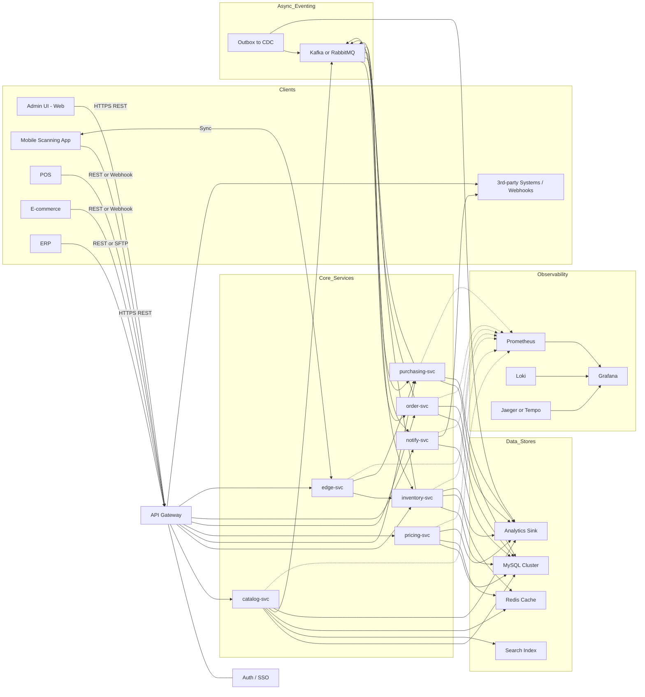

# Microservices Integration Diagram — Inventory SaaS (Simplified)
_Last updated: 2025-08-31 13:11 UTC_

```mermaid
flowchart LR
  %% Clients & Channels
  subgraph Clients
    AdminUI["Admin UI - Web"]
    MobileApp["Mobile Scanning App"]
    POS["POS"]
    ECom["E-commerce"]
    ERP["ERP"]
    ExtSys["3rd-party Systems / Webhooks"]
  end

  %% Edge / Security
  APIGW["API Gateway"]
  Auth["Auth / SSO"]
  APIGW --- Auth

  %% Core Services
  subgraph Core_Services
    Catalog["catalog-svc"]
    Inventory["inventory-svc"]
    Purchasing["purchasing-svc"]
    Pricing["pricing-svc"]
    Orders["order-svc"]
    Notify["notify-svc"]
    EdgeSvc["edge-svc"]
  end

  %% Async/Eventing
  subgraph Async_Eventing
    Broker["Kafka or RabbitMQ"]
    Outbox["Outbox to CDC"]
  end

  %% Data Stores
  subgraph Data_Stores
    MySQL["MySQL Cluster"]
    Redis["Redis Cache"]
    Search["Search Index"]
    Analytics["Analytics Sink"]
  end

  %% Observability
  subgraph Observability
    Prom["Prometheus"]
    Graf["Grafana"]
    Logs["Loki"]
    Trace["Jaeger or Tempo"]
  end

  %% Connectivity: Clients -> API Gateway
  AdminUI -->|HTTPS REST| APIGW
  MobileApp -->|HTTPS REST| APIGW
  POS -->|REST or Webhook| APIGW
  ECom -->|REST or Webhook| APIGW
  ERP -->|REST or SFTP| APIGW

  %% Routing: API Gateway -> Services
  APIGW --> Catalog
  APIGW --> Inventory
  APIGW --> Purchasing
  APIGW --> Pricing
  APIGW --> Orders
  APIGW --> Notify
  APIGW --> EdgeSvc

  %% Service-to-Data
  Catalog --> MySQL
  Inventory --> MySQL
  Purchasing --> MySQL
  Pricing --> MySQL
  Orders --> MySQL
  Notify --> MySQL
  Catalog --> Search

  %% Cache
  Pricing --> Redis
  Catalog --> Redis
  Inventory --> Redis

  %% Events
  Inventory --> Broker
  Purchasing --> Broker
  Orders --> Broker
  Catalog --> Broker
  Broker --> Orders
  Broker --> Inventory
  Broker --> Purchasing
  Broker --> Notify

  %% Outbox/CDC to Broker and Analytics
  Outbox --> Broker
  Outbox --> Analytics

  %% Reporting/Analytics
  Inventory --> Analytics
  Purchasing --> Analytics
  Orders --> Analytics
  Catalog --> Analytics
  Pricing --> Analytics

  %% Notifications & Webhooks
  Notify --> ExtSys
  APIGW --> ExtSys

  %% Edge Sync
  MobileApp <-->|Sync| EdgeSvc
  EdgeSvc --> Inventory
  EdgeSvc --> Purchasing

  %% Observability wiring
  Catalog -.-> Prom
  Inventory -.-> Prom
  Purchasing -.-> Prom
  Pricing -.-> Prom
  Orders -.-> Prom
  Notify -.-> Prom
  EdgeSvc -.-> Prom
  Prom --> Graf
  Logs --> Graf
  Trace --> Graf
```
