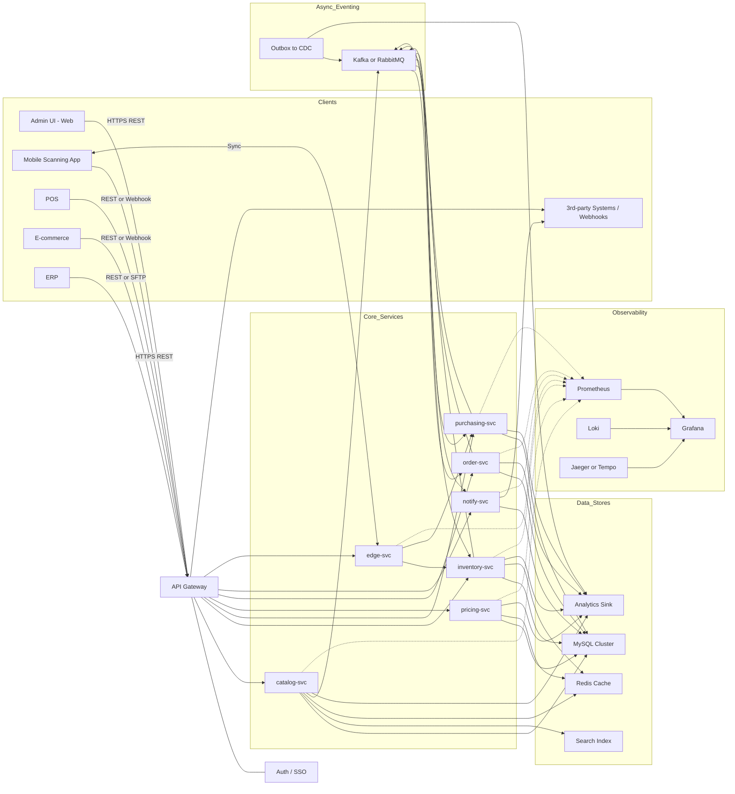

# Technology Stack and Architecture

_Last updated: 2025-09-03_

## Overview

This document outlines the complete technology stack, architectural decisions, and development practices for the modern Inventory Management System. It covers both current implementation and future scalability considerations for microservices architecture.

---

# Technology Stack

## Backend Core Technologies

### Primary Framework Stack
- **Java 17+** - Primary programming language (LTS version)
- **Spring Boot 3.x** - Main application framework and auto-configuration
- **Spring Security 6.x** - Authentication, authorization, and security
- **Spring Data JPA** - Data access layer and ORM
- **Spring Web** - REST API development and MVC framework
- **Spring Boot Actuator** - Health checks, metrics, and monitoring endpoints

### Database Technologies
- **MySQL 8.0+** - Primary relational database with InnoDB engine
- **Flyway** - Database migration and schema versioning tool
- **Redis 6.x** - Caching, session management, and distributed data store

### Security & Authentication
- **Spring Security** - Core security framework and filters
- **JWT (JSON Web Tokens)** - Stateless authentication and authorization
- **BCrypt** - Secure password hashing algorithm
- **OWASP Java Encoder** - Input sanitization and XSS prevention

### API & Documentation
- **OpenAPI 3** (Swagger) - API specification and documentation
- **Spring Boot Actuator** - Production-ready features (health, metrics, info)
- **MapStruct** - Type-safe mapping between DTOs and entities

### Testing Framework
- **JUnit 5** - Unit testing framework with Jupiter API
- **Mockito** - Mocking framework for unit tests
- **Testcontainers** - Integration testing with real database instances
- **Spring Boot Test** - Integration testing with Spring application context
- **Spring Cloud Contract** - Consumer-driven contract testing

### Build & Development Tools
- **Maven 3.8+** - Build automation and dependency management
- **Docker & Docker Compose** - Containerization and local development
- **Git** - Version control and collaboration

---

# Architecture Overview

## Current Architecture Pattern

### Modular Monolith
The current implementation follows a modular monolith pattern with clear domain boundaries:
- **Domain-driven design** with bounded contexts
- **Layered architecture** (Controller → Service → Repository → Entity)
- **Clear separation** between different business domains
- **Prepared for microservices** migration path

### Core Domain Modules
```
├── auth/           # Authentication & Authorization
├── catalog/        # Items, Categories, Variants
├── inventory/      # Stock Control & Movements  
├── purchasing/     # Suppliers, POs, Receiving
├── pricing/        # Price Lists & Promotions
├── orders/         # Reservations & Fulfillment
├── reporting/      # Analytics & Insights
└── notifications/  # Alerts & Communications
```

## Future Microservices Architecture

### Target Service Decomposition

| Domain | Service | Primary Store | Responsibility |
|--------|---------|---------------|----------------|
| Catalog | catalog-svc | MySQL schema `catalog` | Items, variants, attributes, categories |
| Inventory | inventory-svc | MySQL schema `inventory` | Event-sourced ledger, stock summaries, reservations |
| Purchasing | purchasing-svc | MySQL schema `purchasing` | Suppliers, POs, receipts |
| Pricing/Promotions | pricing-svc | MySQL schema `pricing` | Price lists, promotions, rules |
| Orders/Fulfillment | order-svc | MySQL schema `orders` | Reservations, pick/pack/ship workflows |
| Reporting | reporting-svc | MySQL replica/OLAP | Materialized views, ETL to data lake |
| Auth/RBAC | auth-svc | External (Keycloak) | OIDC roles, claims, user management |
| Notifications | notify-svc | MySQL `ops` | Email/SMS/webhooks, alerts |
| Mobile Edge | edge-svc | SQLite/embedded | Offline queue, sync capabilities |

### Microservices Integration Diagram



---

# Database Architecture

## Current Single Database Design

### Multi-Tenant Strategy
- **Single database** with **row-level isolation** by `tenant_id`
- All business tables include `tenant_id` for tenant scoping
- Enforce isolation in application layer through JWT claims
- Composite unique keys include `tenant_id` for data integrity

### Core Database Patterns
- **Event Sourcing** for inventory movements: immutable `inventory_ledger` as source of truth
- **CQRS-lite**: Write models in core services; read models for dashboards
- **Optimistic concurrency** on stock reservations
- **Outbox pattern** for reliable domain event publishing

## Future Per-Service Database Strategy

### Database Per Service Pattern
```sql
-- catalog schema
CREATE TABLE item (
  id BIGINT PRIMARY KEY AUTO_INCREMENT,
  tenant_id BIGINT NOT NULL,
  sku VARCHAR(64) NOT NULL,
  name VARCHAR(255) NOT NULL,
  brand VARCHAR(128),
  category_id BIGINT,
  status VARCHAR(20) NOT NULL, -- 'DRAFT','ACTIVE','DISCONTINUED'
  created_at TIMESTAMP NOT NULL,
  updated_at TIMESTAMP NOT NULL,
  UNIQUE KEY uq_item_sku_tenant (tenant_id, sku)
);

-- inventory schema  
CREATE TABLE inventory_ledger (
  id BIGINT PRIMARY KEY AUTO_INCREMENT,
  tenant_id BIGINT NOT NULL,
  location_id BIGINT NOT NULL,
  variant_id BIGINT NOT NULL,
  ref_type VARCHAR(32) NOT NULL, -- RECEIPT, SHIPMENT, TRANSFER, ADJUSTMENT, COUNT
  ref_id VARCHAR(64) NOT NULL,
  qty_delta INT NOT NULL,
  reason_code VARCHAR(32),
  ts TIMESTAMP NOT NULL DEFAULT CURRENT_TIMESTAMP,
  user_id BIGINT,
  -- Idempotency constraint
  UNIQUE KEY uq_ledger_idem (tenant_id, ref_type, ref_id, variant_id, location_id),
  KEY ix_led_loc_sku_ts (tenant_id, location_id, variant_id, ts)
);

CREATE TABLE stock_summary (
  tenant_id BIGINT NOT NULL,
  location_id BIGINT NOT NULL,
  variant_id BIGINT NOT NULL,
  on_hand INT NOT NULL DEFAULT 0,
  reserved INT NOT NULL DEFAULT 0,
  available INT AS (on_hand - reserved) STORED,
  updated_at TIMESTAMP NOT NULL,
  PRIMARY KEY (tenant_id, location_id, variant_id)
);
```

### Scaling Strategies
- **Sharding/Partitioning**: Range or hash partition by `(location_id)` or `(location_id, variant_id)`
- **Read Scaling**: MySQL replicas with ProxySQL for read/write routing
- **Connection Pooling**: HikariCP with appropriate pool sizing
- **Archival**: Move closed ledger periods to cheaper storage via ETL

---

# Development Practices

## Code Quality Standards

### Testing Strategy
- **Test-Driven Development (TDD)** for core domain logic
- **Behavior-Driven Development (BDD)** for complex business scenarios
- **Contract Testing** with Spring Cloud Contract for service boundaries
- **Integration Testing** with Testcontainers for database scenarios
- **End-to-End Testing** with realistic data scenarios

### Static Analysis & Security
- **SonarQube** - Comprehensive code quality analysis
- **SpotBugs** - Static analysis for potential bugs
- **Checkstyle** - Code style and formatting enforcement
- **OWASP Dependency Check** - Vulnerability scanning for dependencies
- **SAST (Static Application Security Testing)** in CI pipeline

### API-First Development
- **OpenAPI-First**: Define schemas before implementation
- **Generate Clients**: Auto-generate client SDKs from OpenAPI specs
- **Schema Validation**: Lint and validate OpenAPI schemas in CI
- **Documentation**: Keep API docs in sync with implementation

## Development Environment Setup

### Prerequisites Checklist

**Required Software**:
- [ ] **Java 17+** (Oracle JDK or OpenJDK)
- [ ] **Maven 3.8+** for dependency management
- [ ] **Docker Desktop** for local services
- [ ] **Git** for version control

**Recommended IDE**:
- [ ] IntelliJ IDEA Community/Ultimate
- [ ] VS Code with Java Extension Pack
- [ ] Eclipse IDE for Java Developers

**Optional Tools**:
- [ ] **Postman** or **Insomnia** for API testing
- [ ] **MySQL Workbench** for database GUI
- [ ] **Redis Desktop Manager** for cache inspection

### Local Environment Configuration

#### Environment Variables
```bash
# JDK Configuration (Critical)
export JAVA_HOME=$(/usr/libexec/java_home -v 17)  # macOS
export JAVA_HOME=/usr/lib/jvm/java-17-openjdk    # Linux

# Database Configuration
export DB_URL=jdbc:mysql://127.0.0.1:3307/inventory_saas
export DB_USERNAME=inventory_user
export DB_PASSWORD=inventory_pass

# Security Configuration
export JWT_SECRET=your-256-bit-secret-key-here
export ENCRYPTION_SECRET=your-aes-256-encryption-key

# Email Configuration (Optional)
export MAIL_HOST=smtp.gmail.com
export MAIL_USERNAME=your-email@example.com
export MAIL_PASSWORD=your-app-password
```

#### Application Configuration
```yaml
# application-local.yml
spring:
  profiles:
    active: local
  datasource:
    url: ${DB_URL:jdbc:mysql://127.0.0.1:3307/inventory_saas}
    username: ${DB_USERNAME:inventory_user}
    password: ${DB_PASSWORD:inventory_pass}
  data:
    redis:
      host: localhost
      port: 6379

# Security settings
app:
  jwt:
    secret: ${JWT_SECRET:default-dev-secret-change-in-production}
    expiration: 28800  # 8 hours
```

### Build and Development Workflow

#### Standard Development Commands
```bash
# Initial Setup
git clone <repository-url>
cd inventory-management-system

# Start Infrastructure
docker-compose up -d mysql redis

# Build Application
mvn clean compile

# Run Database Migrations
mvn flyway:migrate

# Run Tests
mvn test

# Start Application
mvn spring-boot:run

# Package for Deployment
mvn clean package -DskipTests
```

#### Database Management
```bash
# Create New Migration
# Create: src/main/resources/db/migration/V{version}__{description}.sql

# Apply Migrations
mvn flyway:migrate

# Check Migration Status
mvn flyway:info

# Repair Failed Migrations (Development Only)
mvn flyway:repair

# Clean Database (⚠️ DESTRUCTIVE - Development Only)
mvn flyway:clean
```

### Recent Updates & Migration Notes (2025-09-03)

#### Critical Configuration Changes
- **JDK Version**: Project validated with JDK 17 in development environments
- **Database Port**: Changed from 3306 to 3307 to avoid local MySQL conflicts
- **Schema Migrations**: V4-V8 converted MySQL `ENUM` to `VARCHAR` for JPA compatibility
- **Build Configuration**: `spring-boot-maven-plugin` explicitly pinned for consistency

#### Migration Strategy
- **Never modify** already-applied migration files
- **Always create forward migrations** for schema changes (e.g., `V9__description.sql`)
- **Test migrations** in development before applying to other environments
- **Use VARCHAR** instead of `ENUM` for new enum-type columns to match JPA mappings

#### VS Code Integration
- Workspace configured to use `${env:JAVA_HOME}` for consistency
- Ensure terminal and IDE use the same JDK version
- Extensions recommended: Java Extension Pack, Spring Boot Tools

---

# Feature Development Roadmap

## Phase 1: Foundation & Core Features (Current)
- ✅ **Architecture & Platform**: Spring Boot services with common libraries
- ✅ **Multi-Tenant Support**: Row-level isolation with `tenant_id`
- ✅ **Authentication & Security**: JWT-based auth with Spring Security
- ✅ **Database Foundation**: MySQL with Flyway migrations
- 🔄 **Item & Catalog Management**: CRUD operations with validation
- 🔄 **Basic Inventory Control**: Ledger-based stock movements

## Phase 2: Advanced Inventory Management
- **Stock Control & Movements**: Event-sourced inventory ledger
- **Purchasing & Replenishment**: Supplier management, PO workflows
- **Serial/Lot Tracking**: Optional traceability features
- **Multi-Location Support**: Location-based inventory segregation
- **Reservations System**: Atomic stock reservation with optimistic locking

## Phase 3: Business Operations
- **Pricing & Promotions**: Flexible pricing rules engine
- **Order Management**: End-to-end order fulfillment workflows
- **Reporting & Analytics**: KPI dashboards and business insights
- **Mobile Support**: Scanning and offline capabilities
- **Integration Layer**: Webhook and API gateway infrastructure

## Phase 4: Enterprise Features
- **Microservices Migration**: Service decomposition with event-driven architecture
- **Advanced Security**: RBAC, field-level security, compliance features
- **Performance Optimization**: Caching strategies, read replicas, partitioning
- **Observability**: Comprehensive monitoring with Prometheus and Grafana
- **DevSecOps**: CI/CD pipelines, security scanning, automated testing

---

# Production Considerations

## Scalability Targets

### Performance Requirements
- **API Response Times**: p95 < 200ms for read operations, p95 < 500ms for write operations
- **Throughput**: Support 1000+ concurrent users per service
- **Database Performance**: Handle 10K+ inventory movements per hour
- **Cache Hit Ratio**: > 95% for frequently accessed data

### Horizontal Scaling Strategy
- **Load Balancing**: Multiple application instances behind load balancer
- **Database Scaling**: Read replicas for query scaling
- **Cache Scaling**: Redis cluster for distributed caching
- **Message Processing**: Kafka partitioning for parallel event processing

## Security & Compliance

### Security Implementation
- **Authentication**: Multi-factor authentication (MFA) support
- **Authorization**: Fine-grained RBAC with method-level security
- **Data Protection**: Encryption at rest and in transit
- **Audit Logging**: Comprehensive audit trail for compliance
- **Input Validation**: OWASP-compliant input sanitization

### Compliance Features
- **GDPR**: Data export, deletion, and consent management
- **SOC 2**: Security controls and audit capabilities
- **PCI DSS**: Payment data protection (if applicable)
- **HIPAA**: Healthcare data protection (if applicable)

## Monitoring & Observability

### Metrics Collection
- **Application Metrics**: Request rates, response times, error rates
- **Business Metrics**: Inventory accuracy, order fulfillment rates
- **Infrastructure Metrics**: CPU, memory, disk, network utilization
- **Database Metrics**: Connection pool usage, query performance

### Observability Stack
- **Metrics**: Micrometer + Prometheus for time-series metrics
- **Logging**: Structured logging with Logback + centralized collection
- **Tracing**: Distributed tracing with Spring Cloud Sleuth + Jaeger
- **Dashboards**: Grafana dashboards for visualization and alerting

---

# Integration Architecture

## Event-Driven Communication

### Domain Events
```java
// Example domain events
public class InventoryAdjustedEvent {
    private String tenantId;
    private String locationId;
    private String variantId;
    private int quantityDelta;
    private String reasonCode;
    private Instant timestamp;
}

public class PurchaseOrderReceivedEvent {
    private String tenantId;
    private String purchaseOrderId;
    private List<ReceivedItem> items;
    private Instant receivedAt;
}
```

### Message Broker Integration
- **Kafka**: High-throughput event streaming for inventory movements
- **RabbitMQ**: Reliable message delivery for business workflows
- **Outbox Pattern**: Transactional event publishing with guaranteed delivery
- **CDC (Change Data Capture)**: Debezium for database event streaming

## External System Integration

### API Gateway Capabilities
- **Rate Limiting**: Per-tenant and per-endpoint rate limiting
- **Authentication**: JWT validation and token refresh
- **Request/Response Transformation**: Protocol adaptation
- **Circuit Breaking**: Fault tolerance for downstream services

### Integration Patterns
- **Webhooks**: Outbound notifications to external systems
- **File-Based Integration**: SFTP/CSV processing with validation
- **Real-Time APIs**: REST and GraphQL endpoints
- **Batch Processing**: ETL jobs for data synchronization

---

# Quality Assurance

## Testing Strategy

### Unit Testing
```java
@ExtendWith(MockitoExtension.class)
class InventoryServiceTest {
    
    @Mock
    private InventoryRepository inventoryRepository;
    
    @Test
    void shouldCreateInventoryMovement() {
        // Given
        var request = new CreateMovementRequest(/* ... */);
        
        // When
        var result = inventoryService.createMovement(request);
        
        // Then
        assertThat(result).isNotNull();
        verify(inventoryRepository).save(any(InventoryLedger.class));
    }
}
```

### Integration Testing
```java
@SpringBootTest
@Testcontainers
class InventoryIntegrationTest {
    
    @Container
    static MySQLContainer<?> mysql = new MySQLContainer<>("mysql:8.0")
            .withDatabaseName("test_inventory")
            .withUsername("test")
            .withPassword("test");
    
    @Test
    void shouldPersistInventoryMovement() {
        // Integration test with real database
    }
}
```

### Performance Testing
- **Load Testing**: Gatling/JMeter for API performance validation
- **Stress Testing**: System behavior under extreme load
- **Volume Testing**: Database performance with large datasets
- **Profiling**: JFR (Java Flight Recorder) for performance analysis

## Deployment Quality Gates

### CI/CD Pipeline Stages
1. **Build**: Compile, dependency resolution, static analysis
2. **Test**: Unit tests, integration tests, security scans
3. **Quality**: SonarQube analysis, code coverage validation
4. **Security**: Vulnerability scanning, dependency checks
5. **Package**: Container image building and signing
6. **Deploy**: Environment-specific deployment with smoke tests

### Release Criteria
- ✅ All tests passing (unit, integration, security)
- ✅ Code coverage > 80% for new code
- ✅ No high-severity security vulnerabilities
- ✅ Performance benchmarks met
- ✅ Documentation updated
- ✅ Database migrations validated

---

# References and Resources

## Technical Documentation
- **Spring Boot**: [https://spring.io/projects/spring-boot](https://spring.io/projects/spring-boot)
- **Spring Security**: [https://spring.io/projects/spring-security](https://spring.io/projects/spring-security)
- **MySQL**: [https://dev.mysql.com/doc/](https://dev.mysql.com/doc/)
- **Docker**: [https://docs.docker.com/](https://docs.docker.com/)

## Development Tools
- **Maven**: [https://maven.apache.org/guides/](https://maven.apache.org/guides/)
- **Flyway**: [https://flywaydb.org/documentation/](https://flywaydb.org/documentation/)
- **Testcontainers**: [https://www.testcontainers.org/](https://www.testcontainers.org/)
- **JUnit 5**: [https://junit.org/junit5/docs/current/user-guide/](https://junit.org/junit5/docs/current/user-guide/)

## Architecture & Best Practices
- **Domain-Driven Design**: Evans, Eric - "Domain-Driven Design"
- **Microservices Patterns**: Richardson, Chris - "Microservices Patterns"
- **Clean Architecture**: Martin, Robert - "Clean Architecture"
- **Spring Boot Best Practices**: Official Spring guides and documentation

## Consolidated From
This document consolidates information from:
- TECH_STACK_REQUIREMENTS.md
- development_plan.md  
- microservices_integration_diagram.md